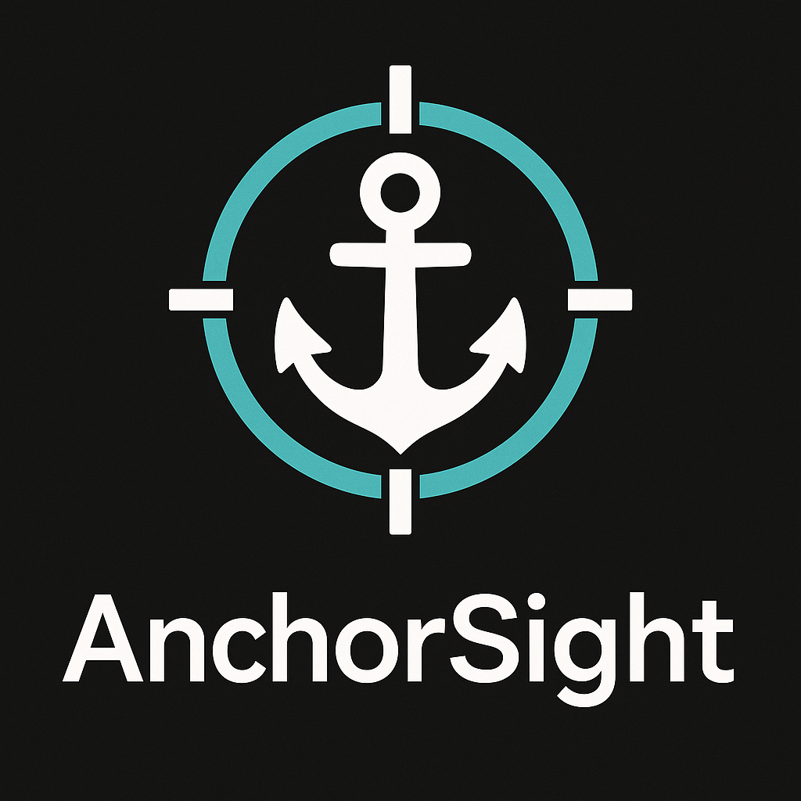

<!-- PROJECT LOGO -->
<p align="center">
  <a href="https://github.com/BuddyAnonymous/anchorsight">
   
  </a>

  <h1 align="center">AnchorSight</h1>

  <p align="center">
    Tool for visualizing Solana Anchor program data.
  </p>
</p>

<!-- ABOUT THE PROJECT -->

## About the Project

### Demo video: https://www.loom.com/share/6c16da2fb47546e4af46c063f3a0e2ff?sid=52a57855-e057-4ff1-8cc4-dc2ddb95e4c2


## How to run project

1. Clone the repo.

   ```sh
   git clone https://github.com/BuddyAnonymous/anchorsight
   ```

2. Go to the project folder

   ```sh
   cd anchorsight
   ```

3. Install packages

   ```sh
   pnpm install
   ```

4. Run the project

   ```sh
   npx anchorsight --rpc-url <YOUR_RPC_ULR> --idl <PATH_TO_IDL_FILE>

   # Running on http://localhost:3000/
   ```

   For demo we used Mango V4 IDL from src/data/anchor/mango_v4.json

